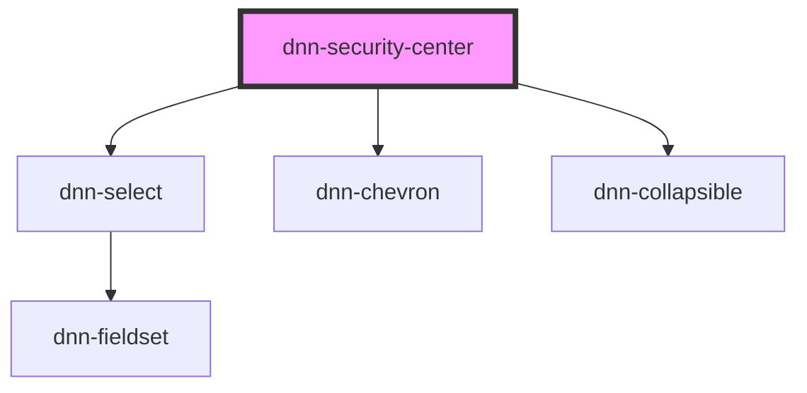

# my-component

Root component that does all the module rendering.

<!-- Auto Generated Below -->

## Properties

| Property                | Attribute   | Description                                                  | Type     | Default     |
| ----------------------- | ----------- | ------------------------------------------------------------ | -------- | ----------- |
| `moduleId` _(required)_ | `module-id` | The Dnn module id, required in order to access web services. | `number` | `undefined` |

## Dependencies

### Depends on

- dnn-select
- dnn-chevron
- dnn-collapsible

### Graph

----------------------------------------------

*Built with [StencilJS](https://stenciljs.com/)*
